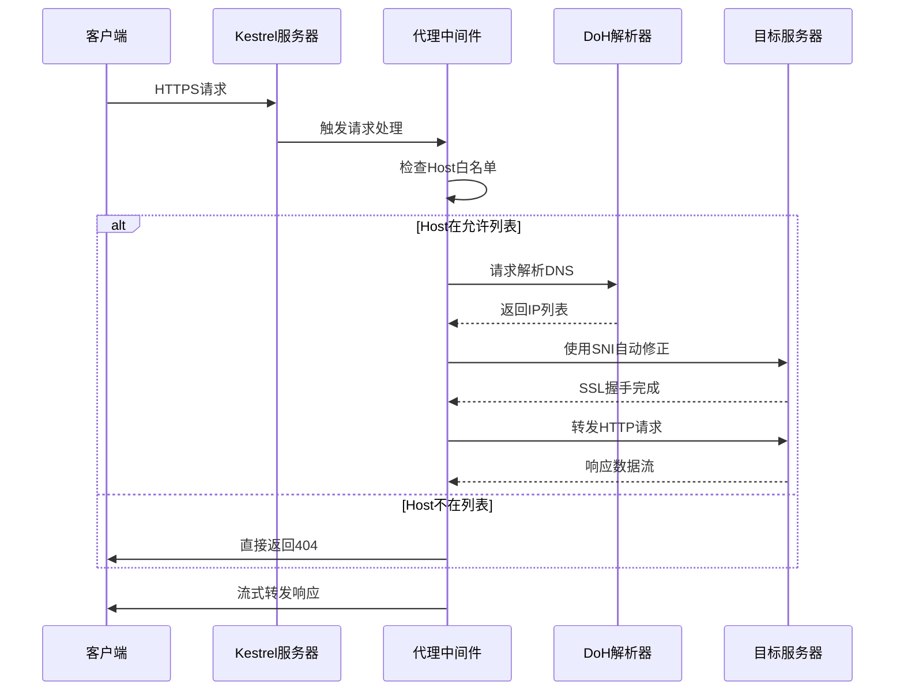
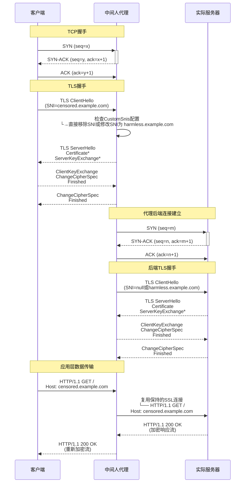

# YASRP - 基于域前置技术的网络隐蔽通信POC

**核心处理流程**

  
**生命周期例**

```mermaid
gantt
    title 生命周期
    dateFormat  X
    axisFormat %s
    section 核心组件
        初始化: done, init, 0, 1
        Kestrel服务器运行: active, kestrel, after init, 10
        HttpClient连接池: active, httpclient, after init, 10
        DNS预热任务: dns_warmup, after init, 8
    section 请求处理
        接收请求: req1, after kestrel, 1
        DNS解析: dns, after req1, 2
        建立SSL连接: ssl, after dns, 3
        代理请求: proxy, after ssl, 5
        响应返回: response, after proxy, 2
```

### 项目配置文件
本PoC使用Yaml作为配置文件的语言，并支持过程的部分自定义
```yaml
# 目标域名，List类型，不支持通配符
# 目标域名即本PoC会处理的域名
targetDomains: []

# 自定义SNI，Dictionary<string, string>类型，K为上面定义的目标域名，V为自定义SNI。
# 本PoC默认将SNI移除，但是，若一个目标域名定义了自定义SNI，PoC将会使用定义的SNI.
customSnis: {}

# 仅支持DoH，并且对方必须支持标准dns-message
dns:
  # 每次查询都会首先使用此DoH服务器进行查询
  primaryDohServer: https://doh.apad.pro/cdn-query
  # 优先使用此DoH服务器进行查询，若第一次查询失败，则使用此列表中的DoH服务器进行查询（顺序）
  fallbackDohServers:
  - https://9.9.9.9/dns-query
  - https://1.1.1.1/dns-query
  - https://101.101.101.101/dns-query
  - https://208.67.222.222/dns-query
  - https://223.5.5.5/dns-query
  
  # 暂时未使用
  plainDnsServer: 1.1.1.1
  
  # 是否要在程序启动时提前生成DNS缓存？
  dnsWarmup: true
  
  # 每个域名的DNS缓存的生成间隔（毫秒）？
  # 减少此值将提高DNS预热过程的速度，但可能会也会增加对网络和DoH服务器的负载
  dnsWarmupDelayMs: 1000
  
  # DNS缓存的最大条数
  # 可以适当提高此值，DNS缓存的占用并不高
  maxCacheSize: 1000
  
  # 检查DNS缓存的间隔（分钟）
  cleanupIntervalMinutes: 5
  
  # 生成DNS解析时最大等待时间（毫秒）
  maxDnsTimeout: 2000
  
  # 生成DNS解析时最大重试次数
  maxRetries: 3
  
  # 生成DNS解析时，如果遇到cname记录的最大递归查询次数
  maxCnameRecursion: 8
  
  # 生成DNS解析时最大重试基数因子（毫秒）
  retryBaseDelay: 100
  
  # 生成最大解析时最大重试延时（毫秒）
  retryMaxDelay: 3000
ipSelection:
  # 过滤IP的策略类型，目前支持MinimumPing
  strategy: MinimumPing
  # 过滤IP的最小延迟（毫秒）
  # 低于此值将视作不可达
  maxResponseTimeMs: 1000
  
  # DNS缓存的ttl（分钟）
  cacheDurationMinutes: 1440
logging:
  level: Info
kestrel:
  # Kestrel Web Server的监听地址
  listenAddress: 127.0.0.1
  # Kestrel Web Server的监听端口
  listenPort: 443

```
##  实验与分析  
  ###  预期数据包过程


### Wireshark数据包分析
通过curl进行HTTP请求
首先，在本地运行PoC，并构建curl命令尝试对huggingface.co发起一次请求：

```shell
curl --resolve huggingface.co:443:127.0.0.1 -L -k https://huggingface.co/ -v --output /dev/null 
```
输出：
```shell
* Added huggingface.co:443:127.0.0.1 to DNS cache
* Hostname huggingface.co was found in DNS cache
*   Trying 127.0.0.1:443...
    % Total    % Received % Xferd  Average Speed   Time    Time     Time  Current
    Dload  Upload   Total   Spent    Left  Speed
    0     0    0     0    0     0      0      0 --:--:-- --:--:-- --:--:--     0* Connected to huggingface.co (127.0.0.1) port 443 (#0)
* ALPN, offering h2
* ALPN, offering http/1.1
* TLSv1.0 (OUT), TLS header, Certificate Status (22):
  } [5 bytes data]
* TLSv1.3 (OUT), TLS handshake, Client hello (1):
  } [512 bytes data]
* TLSv1.2 (IN), TLS header, Certificate Status (22):
  { [5 bytes data]
* TLSv1.3 (IN), TLS handshake, Server hello (2):
  { [122 bytes data]
* TLSv1.2 (IN), TLS header, Finished (20):
  { [5 bytes data]
* TLSv1.2 (IN), TLS header, Supplemental data (23):
  { [5 bytes data]
* TLSv1.3 (IN), TLS handshake, Encrypted Extensions (8):
  { [15 bytes data]
* TLSv1.2 (IN), TLS header, Supplemental data (23):
  { [5 bytes data]
* TLSv1.3 (IN), TLS handshake, Certificate (11):
  { [2546 bytes data]
* TLSv1.2 (IN), TLS header, Supplemental data (23):
  { [5 bytes data]
* TLSv1.3 (IN), TLS handshake, CERT verify (15):
  { [264 bytes data]
* TLSv1.2 (IN), TLS header, Supplemental data (23):
  { [5 bytes data]
* TLSv1.3 (IN), TLS handshake, Finished (20):
  { [52 bytes data]
* TLSv1.2 (OUT), TLS header, Finished (20):
  } [5 bytes data]
* TLSv1.3 (OUT), TLS change cipher, Change cipher spec (1):
  } [1 bytes data]
* TLSv1.2 (OUT), TLS header, Supplemental data (23):
  } [5 bytes data]
* TLSv1.3 (OUT), TLS handshake, Finished (20):
  } [52 bytes data]
* SSL connection using TLSv1.3 / TLS_AES_256_GCM_SHA384
* ALPN, server accepted to use h2
* Server certificate:
*  subject: CN=steamcommunity.com
*  start date: Mar  4 03:21:46 2025 GMT
*  expire date: Mar  4 03:21:46 2026 GMT
*  issuer: CN=YASRP
*  SSL certificate verify result: unable to get local issuer certificate (20), continuing anyway.
* Using HTTP2, server supports multiplexing
* Connection state changed (HTTP/2 confirmed)
* Copying HTTP/2 data in stream buffer to connection buffer after upgrade: len=0
* TLSv1.2 (OUT), TLS header, Supplemental data (23):
  } [5 bytes data]
* TLSv1.2 (OUT), TLS header, Supplemental data (23):
  } [5 bytes data]
* TLSv1.2 (OUT), TLS header, Supplemental data (23):
  } [5 bytes data]
* Using Stream ID: 1 (easy handle 0x64f32e6f2eb0)
* TLSv1.2 (OUT), TLS header, Supplemental data (23):
  } [5 bytes data]
> GET / HTTP/2
> Host: huggingface.co
> user-agent: curl/7.81.0
> accept: */*
>
* TLSv1.2 (IN), TLS header, Supplemental data (23):
  { [5 bytes data]
* TLSv1.3 (IN), TLS handshake, Newsession Ticket (4):
  { [265 bytes data]
* TLSv1.2 (IN), TLS header, Supplemental data (23):
  { [5 bytes data]
* TLSv1.3 (IN), TLS handshake, Newsession Ticket (4):
  { [265 bytes data]
* old SSL session ID is stale, removing
* TLSv1.2 (IN), TLS header, Supplemental data (23):
  { [5 bytes data]
* TLSv1.2 (OUT), TLS header, Supplemental data (23):
  } [5 bytes data]
* TLSv1.2 (IN), TLS header, Supplemental data (23):
  { [5 bytes data]
* TLSv1.2 (IN), TLS header, Supplemental data (23):
  { [5 bytes data]
* TLSv1.2 (IN), TLS header, Supplemental data (23):
  { [5 bytes data]

```

curl客户端已经和反向代理握手完成，接下来查看wireshark反向代理与实际服务器建立握手过程：
)

在Client Hello中，SNI并不是原本请求的huggingface.co，然而，CDN目标服务器还是发送了Server Hello建立握手，接着传输数据。


