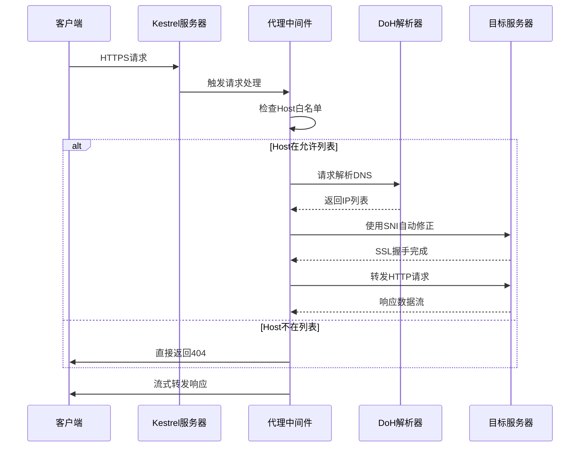

# YASRP - 基于域前置技术的网络隐蔽通信POC

**摘要**

## 1. 引言
  ### 1.1 研究背景
域前置技术的核心在于利用TLS握手层（ClientHello）与HTTP应用层主机头的协议分层差异，在客户端与CDN
节点间建立可信加密连接的同时，将实际通信目标隐藏于合法域名之后。

**需要特别强调的是，本文提供的技术细节与PoC代码仅供网络安全攻防技术探讨及教学用途。研究者、企业风控团队可基于本成果优化流量检测规则集、提升异常行为识别能力，但任何个人或组织不得将相关内容用于非法目的。网络技术的进步必须以法律框架与公共利益为前提，这也正是本研究的核心立场。**

### 1.2 域前置技术原理与现状
域前置（Domain Fronting）是一种利用HTTPS协议和CDN（内容分发网络）架构的隐蔽通信技术，其核心是通过混淆网络请求的元数据，规避基于网络层的审查机制。本节将从审查对抗、协议特性、应用案例及安全争议四方面展开分析。

#### **1.2.1 审查技术与域前置的对抗逻辑**
现代网络审查机制主要依赖**深度包检测（DPI）**和**主动阻断技术**，典型手段包括：
- **SNI（Server Name Indication）捕获**：TLS握手阶段的`Client Hello`消息（明文传输）中包含目标域名（SNI字段），审查系统可通过SNI识别并阻断对敏感域名的访问请求。
- **RST抢答阻断**：检测到违规流量后，伪造TCP重置（RST）数据包抢答，强制中断连接。

域前置通过**协议分层特性**绕过上述检测：客户端在TLS握手期间与未受审查的“前端域名”（Front Domain）完成加密协商（SNI指向前端域名），但在加密的HTTP层中通过`Host`头字段指定真实的“后端域名”（Backend Domain）。由于`Host`头在HTTPS中已加密传输，审查系统无法获取实际通信目标，而CDN服务商通常会根据`Host`头将请求转发至后端域名服务器，从而实现穿透审查（图1）。

#### **1.2.2 HTTPS协议特性与域名解析机制**
域前置的可行性依赖于以下协议特性：
1. **TLS协商阶段的未加密字段**：`Client Hello`明文包含SNI字段，但部分CDN允许将SNI与`Host`头解耦验证，仅需`Host`头匹配CDN服务商源站即可回源。
2. **HTTP层的加密保护**：真实的`Host`头信息在应用层加密，审查系统仅可观测到外层SNI指向的前端域名（如合法CDN域名）。
3. **CDN路由特性**：若同一CDN节点托管多个域名，仅需SNI指向其任意合法域名即可建立TLS连接，后续根据`Host`头路由至不同的源站，这使得“借道”未被审查的域名成为可能。

  ### 1.3 PoC贡献
在保证协议合规性的前提下，通过.NET Core 8的`SocketsHttpHandler`组件对HTTP/2和TLS 1.3的深度支持，构建语义清晰的域前置流程：（1）在`ConnectCallback`阶段，根据动态映射规则（`config.
CustomSnis`）将原始`Host`头的DNS解析结果与TLS握手中的SNI字段分离；（2）通过`SslStream.AuthenticateAsClientAsync`实现SNI字段的伪装，同时保留加密层外`Host`头的真实指向，完整模拟CDN的回源路径。   
在PoC中明确区分了以下可观测特征：（1）TLS ClientHello中SNI字段与HTTP Host的解耦性；（2）特定CDN的指纹（如证书链、ALPN协议顺序）与域前置流量的关联性。


## 2. PoC设计与实现
### 2.1 技术选型
本框架针对**高隐蔽性**与**低运维成本**原则，建立技术选型矩阵

| **组件**     | **技术选型**              | **关键决策依据**                                                                                |  
|------------|-----------------------|-------------------------------------------------------------------------------------------|  
| **传输协议栈**  | .NET Core 8           | 1. 原生HTTP/2与TLS 1.3无缝衔接能力  2. `SocketsHttpHandler`提供底层TCP连接精准控制  3. **跨平台**兼容性满足实验规模化部署需求 |  
| **请求代理引擎** | Kestrel + Middleware  | 1. 高并发能力    2. 基于流水线架构动态注入`ConnectCallback`                                               |  
| **DNS设施**  | DoH + Local LRU Cache | 1. 规避基于UDP的传统DNS劫持问题  2. 利用公共DoH服务实现解析结果校验  3. **缓存预加载机制**降低首次查询延迟                        |  
| **TLS策略**  | SNI重写 + 证书卸载          | 1. 在握手阶段动态注入`TargetHost`的伪装逻辑  2. 允许绕过中间设备SNI过滤规则                                         |    
  
### 2.2 系统架构图与组件说明

**核心处理流程**

  
**生命周期例**

```mermaid
gantt
    title 生命周期
    dateFormat  X
    axisFormat %s
    section 核心组件
        初始化: done, init, 0, 1
        Kestrel服务器运行: active, kestrel, after init, 10
        HttpClient连接池: active, httpclient, after init, 10
        DNS预热任务: dns_warmup, after init, 8
    section 请求处理
        接收请求: req1, after kestrel, 1
        DNS解析: dns, after req1, 2
        建立SSL连接: ssl, after dns, 3
        代理请求: proxy, after ssl, 5
        响应返回: response, after proxy, 2
```

### 2.3 项目配置文件
本PoC使用Yaml作为配置文件的语言，并支持过程的部分自定义
```yaml
# 目标域名，List类型，不支持通配符
# 目标域名即本PoC会处理的域名
targetDomains: []

# 自定义SNI，Dictionary<string, string>类型，K为上面定义的目标域名，V为自定义SNI。
# 本PoC默认将SNI移除，但是，若一个目标域名定义了自定义SNI，PoC将会使用定义的SNI.
customSnis: {}

# 仅支持DoH，并且对方必须支持标准dns-message
dns:
  # 每次查询都会首先使用此DoH服务器进行查询
  primaryDohServer: https://doh.apad.pro/cdn-query
  # 优先使用此DoH服务器进行查询，若第一次查询失败，则使用此列表中的DoH服务器进行查询（顺序）
  fallbackDohServers:
  - https://9.9.9.9/dns-query
  - https://1.1.1.1/dns-query
  - https://101.101.101.101/dns-query
  - https://208.67.222.222/dns-query
  - https://223.5.5.5/dns-query
  
  # 暂时未使用
  plainDnsServer: 1.1.1.1
  
  # 是否要在程序启动时提前生成DNS缓存？
  dnsWarmup: true
  
  # 每个域名的DNS缓存的生成间隔（毫秒）？
  # 减少此值将提高DNS预热过程的速度，但可能会也会增加对网络和DoH服务器的负载
  dnsWarmupDelayMs: 1000
  
  # DNS缓存的最大条数
  # 可以适当提高此值，DNS缓存的占用并不高
  maxCacheSize: 1000
  
  # 检查DNS缓存的间隔（分钟）
  cleanupIntervalMinutes: 5
  
  # 生成DNS解析时最大等待时间（毫秒）
  maxDnsTimeout: 2000
  
  # 生成DNS解析时最大重试次数
  maxRetries: 3
  
  # 生成DNS解析时，如果遇到cname记录的最大递归查询次数
  maxCnameRecursion: 8
  
  # 生成DNS解析时最大重试基数因子（毫秒）
  retryBaseDelay: 100
  
  # 生成最大解析时最大重试延时（毫秒）
  retryMaxDelay: 3000
ipSelection:
  # 过滤IP的策略类型，目前支持MinimumPing
  strategy: MinimumPing
  # 过滤IP的最小延迟（毫秒）
  # 低于此值将视作不可达
  maxResponseTimeMs: 1000
  
  # DNS缓存的ttl（分钟）
  cacheDurationMinutes: 1440
logging:
  level: Info
kestrel:
  # Kestrel Web Server的监听地址
  listenAddress: 127.0.0.1
  # Kestrel Web Server的监听端口
  listenPort: 443

```
## 3. 实验与分析  
  ### 3.1 预期数据包过程


### 3.2 Wireshark数据包分析
通过curl进行HTTP请求
首先，在本地运行PoC，并构建curl命令尝试对huggingface.co发起一次请求：

```shell
curl --resolve huggingface.co:443:127.0.0.1 -L -k https://huggingface.co/ -v --output /dev/null 
```
输出：
```shell
* Added huggingface.co:443:127.0.0.1 to DNS cache
* Hostname huggingface.co was found in DNS cache
*   Trying 127.0.0.1:443...
    % Total    % Received % Xferd  Average Speed   Time    Time     Time  Current
    Dload  Upload   Total   Spent    Left  Speed
    0     0    0     0    0     0      0      0 --:--:-- --:--:-- --:--:--     0* Connected to huggingface.co (127.0.0.1) port 443 (#0)
* ALPN, offering h2
* ALPN, offering http/1.1
* TLSv1.0 (OUT), TLS header, Certificate Status (22):
  } [5 bytes data]
* TLSv1.3 (OUT), TLS handshake, Client hello (1):
  } [512 bytes data]
* TLSv1.2 (IN), TLS header, Certificate Status (22):
  { [5 bytes data]
* TLSv1.3 (IN), TLS handshake, Server hello (2):
  { [122 bytes data]
* TLSv1.2 (IN), TLS header, Finished (20):
  { [5 bytes data]
* TLSv1.2 (IN), TLS header, Supplemental data (23):
  { [5 bytes data]
* TLSv1.3 (IN), TLS handshake, Encrypted Extensions (8):
  { [15 bytes data]
* TLSv1.2 (IN), TLS header, Supplemental data (23):
  { [5 bytes data]
* TLSv1.3 (IN), TLS handshake, Certificate (11):
  { [2546 bytes data]
* TLSv1.2 (IN), TLS header, Supplemental data (23):
  { [5 bytes data]
* TLSv1.3 (IN), TLS handshake, CERT verify (15):
  { [264 bytes data]
* TLSv1.2 (IN), TLS header, Supplemental data (23):
  { [5 bytes data]
* TLSv1.3 (IN), TLS handshake, Finished (20):
  { [52 bytes data]
* TLSv1.2 (OUT), TLS header, Finished (20):
  } [5 bytes data]
* TLSv1.3 (OUT), TLS change cipher, Change cipher spec (1):
  } [1 bytes data]
* TLSv1.2 (OUT), TLS header, Supplemental data (23):
  } [5 bytes data]
* TLSv1.3 (OUT), TLS handshake, Finished (20):
  } [52 bytes data]
* SSL connection using TLSv1.3 / TLS_AES_256_GCM_SHA384
* ALPN, server accepted to use h2
* Server certificate:
*  subject: CN=steamcommunity.com
*  start date: Mar  4 03:21:46 2025 GMT
*  expire date: Mar  4 03:21:46 2026 GMT
*  issuer: CN=YASRP
*  SSL certificate verify result: unable to get local issuer certificate (20), continuing anyway.
* Using HTTP2, server supports multiplexing
* Connection state changed (HTTP/2 confirmed)
* Copying HTTP/2 data in stream buffer to connection buffer after upgrade: len=0
* TLSv1.2 (OUT), TLS header, Supplemental data (23):
  } [5 bytes data]
* TLSv1.2 (OUT), TLS header, Supplemental data (23):
  } [5 bytes data]
* TLSv1.2 (OUT), TLS header, Supplemental data (23):
  } [5 bytes data]
* Using Stream ID: 1 (easy handle 0x64f32e6f2eb0)
* TLSv1.2 (OUT), TLS header, Supplemental data (23):
  } [5 bytes data]
> GET / HTTP/2
> Host: huggingface.co
> user-agent: curl/7.81.0
> accept: */*
>
* TLSv1.2 (IN), TLS header, Supplemental data (23):
  { [5 bytes data]
* TLSv1.3 (IN), TLS handshake, Newsession Ticket (4):
  { [265 bytes data]
* TLSv1.2 (IN), TLS header, Supplemental data (23):
  { [5 bytes data]
* TLSv1.3 (IN), TLS handshake, Newsession Ticket (4):
  { [265 bytes data]
* old SSL session ID is stale, removing
* TLSv1.2 (IN), TLS header, Supplemental data (23):
  { [5 bytes data]
* TLSv1.2 (OUT), TLS header, Supplemental data (23):
  } [5 bytes data]
* TLSv1.2 (IN), TLS header, Supplemental data (23):
  { [5 bytes data]
* TLSv1.2 (IN), TLS header, Supplemental data (23):
  { [5 bytes data]
* TLSv1.2 (IN), TLS header, Supplemental data (23):
  { [5 bytes data]

```

curl客户端已经和反向代理握手完成，接下来查看wireshark反向代理与实际服务器建立握手过程：
)

在Client Hello中，SNI并不是原本请求的huggingface.co，然而，CDN目标服务器还是发送了Server Hello建立握手，接着传输数据。


